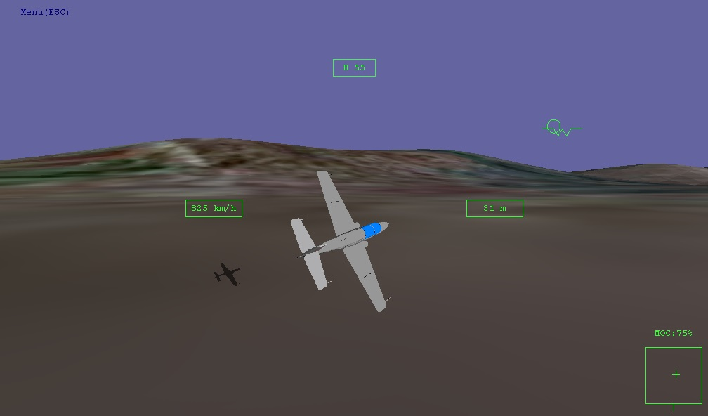

# AnyFlyer
Simple, but realistic flight simulator controlled by mouse. You can modify aerodynamics of your plane easily by script-like files.
## Table of contents
* [General info](#general-info)
* [Screenshot](#screenshot)
* [Technologies](#technologies)
* [Features](#features)
* [Setup](#setup)
* [How to use](#how-to-use)
* [File editing](#file-editing)
* [Project status](#project-status)
* [License](#license)
* [Contact](#contact)

## General info
The project was created, on one hand: because of my passion for aviation, physics and programming. I wanted to create my own virtual world where any winged machine, defined in a few files, could fly and would be controlled by user, even without a joystick.

On the other hand, as a beginner programmer, I wanted to train my C++ skills, learn to operate 3D reality tools like vectors, quaternions and matrices while using a 3D graphics library/engine (Irrlicht was chosen).

## Screenshot

## Technologies
* C++11
* Irrlicht 1.8.4
* Visual Studio 2017 / Windows SDK 10.0
* QT Creator / Linux Mint

## Features
* Physical engine (which is fully contribution of the author) computes forces and moments from airfoils, fuselage and engines in real time.
* The physical engine provides realistic airplane behaviours, like: short period oscillations, phugoid, Dutch roll, stall and spin
* Three types of aircraft available, remarkably different from aerodynamic point of view: an advanced trainer jet, a paramotor and a missile
* More than one aircraft can fly at a time, although only one is controlled by user
* All aircraft properties are easy to configure by text files 

## Setup
Windows, 64 bit systems: download and unpack .zip file from the repository main folder, run anyflyer64.exe. If it does not work, you may need to download and install the Visual Studio 2017 C++ redistributable (x64):

https://aka.ms/vs/15/release/vc_redist.x64.exe

but the 2015 version should also be sufficient

## How to use
After running .exe file, you are in Main Menu, from here you can start the simulation by choosing Fly, change the settings by Plan your flight, or exit application. When the simulation is started, you are at first in pause mode, which you can turn on/off by space key. You can always enter the Simulation Menu (either paused or unpaused) by pressing ESC. When the simulation is going unpaused, you can operate the menu only by cursor keys/enter because the mouse is used to move the stick. When pause is enabled, you can also use mouse pointer to click menu items. Full key/mouse function list you can find in: Simulation Menu/Keys and control description. To make smooth turns it is sometimes better to use pitch trimmer instead of moving the mouse up/down. There are two important HUD symbols you must be aware when flying: a waterline mark (similar to 'W' letter) indicates where the aircraft's nose is pointed. A small circle represents the speed vector - the aircraft moves exactly at the direction indicated by the circle.

In the current version of the project, you have three aircraft available (however you can modify them and add new ones).
They are: TS-11 Iskra advanced trainer jet, powered paraglider (Paramotor) and Tomahawk missile. The most easy to fly is Iskra. When flying the Paramotor, use throttle carefully, default 75% from start will make it turn up side down and eventually stall. Controlling Tomahawk is not easy here, but I guess it would not be in reality either - mass of about 1300 kilograms and very small wings make it very prone to stall and spin. Anyway, Tomahawk is not designed to be controlled by a human with stick - the missile computer does the job.
You can land (and take off too) by Iskra and Paramotor, Iskra has retractable gear and flaps. Excessively brutal touchdown will cause crash.

### File editing
You can alter general settings in settings.txt file. There are three typed of data: variable names in parentheses (), following them, but gapped with space variable values in brackets {}, and comments unbracketed. For example you can switch language to Polish by changing (langfile) to {lang-pl.txt}.

Aircraft data, placed in aircraft directory, consist of three types of files: .dat files contain physical properties, they are arranged similarly to settings.txt., Files with .3ds extension are mesh files of 3D Studio type. There are also textures, one for each aircraft is minimum, however each texture should correspond with one mesh in the .3ds file.

## Project status
The project is in an initial status, there are many features to add. However, at this point, a question arises: What is the project's final goal, what and how should it be in the 1.0 version? Well, me, as its creator, can not precisely answer it because my motivation was mainly just making it, not preparing to a certain set of features :-)  

Anyway I can imagine functionalities that can be included. First is release as Linux package. Other ones:
* propeller engines which generate torque
* camera zooming

## License
My work itself is licensed under MIT license, you can find it in LICENSE file in main repository folder.

Irrlicht, the 3D graphics engine which my application uses, is licensed under zlib/libpng (which allows free use both commercial and non-commercial).

dirent.h library: Copyright (c) 1998-2019 Toni Ronkko

Aircraft models are created by myself in Rhino3D software. The paraglider wing is based on a model from: http://laboratoridenvol.com/

## Contact
AnyFlyer is created by Andrzej Rzoska, feel free to contact me!

and_r@o2.pl

